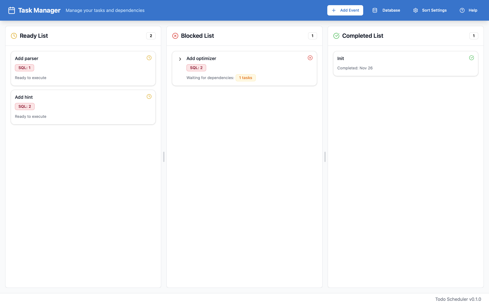

# Todo Scheduler

Scheduler for your todo to make you more productive🤪




## Features

- **Task Management**: Organize tasks into three categories:
  - **Ready List**: Tasks ready to execute
  - **Blocked List**: Tasks waiting for dependencies
  - **Completed List**: Finished tasks
- **Dependency Tracking**: Visualize and manage task dependencies
- **Tag System**: Organize tasks with custom tags
- **Database Management**: Built-in SQLite database for persistent storage
- **Sort Settings**: Customize task sorting preferences

## Prerequisites

Before building and running the project, ensure you have the following installed:

- **Rust** (latest stable version)
- **Node.js** and **npm** (Node.js 18+ recommended)
- **Tauri CLI**

## How to Build and Run

### 1. Install Rust

If you don't have Rust installed, run:

```bash
curl --proto '=https' --tlsv1.2 -sSf https://sh.rustup.rs | sh
```

After installation, restart your terminal or run:

```bash
source $HOME/.cargo/env
```

### 2. Install Node.js and npm

On macOS (using Homebrew):

```bash
brew install node
```

On other platforms, download from [nodejs.org](https://nodejs.org/).

### 3. Install npm Dependencies

Navigate to the project directory and install frontend dependencies:

```bash
npm install
```

### 4. Install Tauri CLI

Install the Tauri CLI globally using Cargo:

```bash
cargo install tauri-cli
```

Alternatively, you can use the Tauri CLI from npm:

```bash
npm install -g @tauri-apps/cli
```

### 5. Development Mode

To run the application in development mode:

```bash
cargo tauri dev
```

Or using npm:

```bash
npm run tauri dev
```

This will start the development server with hot-reload enabled.

### 6. Build for Production

To build a production-ready application:

```bash
cargo tauri build
```

Or using npm:

```bash
npm run tauri build
```

The built application will be located in `src-tauri/target/release/bundle/`:
- **macOS**: `.dmg` file in `bundle/dmg/` and `.app` in `bundle/macos/`
- **Windows**: `.msi` installer in `bundle/msi/`
- **Linux**: `.deb` or `.AppImage` in `bundle/`

